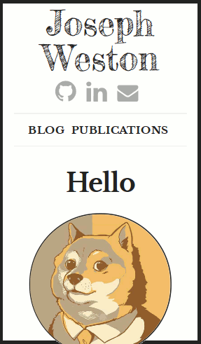
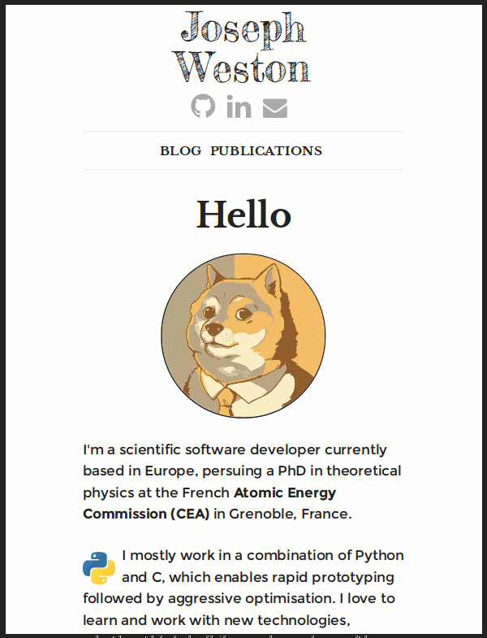
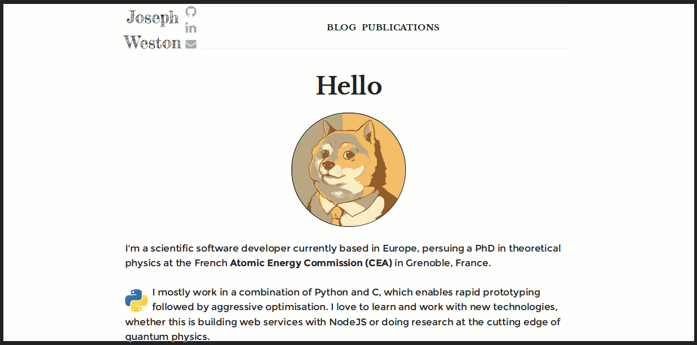

# Mith

a responsive, **mi**nimal **th**eme for Pelican blogs,
based on [Skeleton][skeleton] CSS.

### Variables to set

+ `GITHUB_USER`
+ `LINKEDIN_USER`
+ `EMAIL`
+ `AUTHOR_NAME` -- tuple of (first name, second name, ...). This will be used
  for the author name logo in the top-left corner (see screenshots).

### Screenshots

#### Smartphone

#### iPad

### Desktop

[skeleton]: http://getskeleton.com
